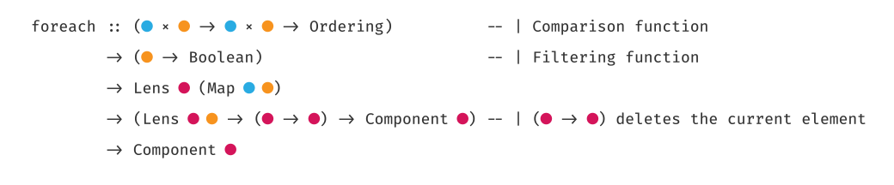
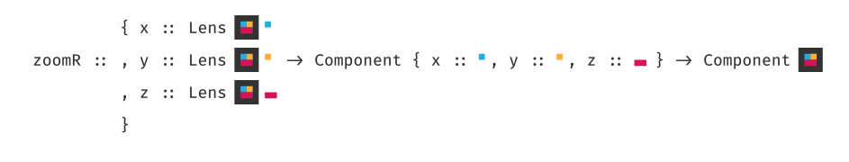

# typedraw

An experimental visualization of types.




`typedraw` replaces all occurences of a given type with a shape described in
a typemap.

## Installation

Install [Fira Code](https://github.com/tonsky/FiraCode). Clone this repository, then:

    npm install

## Usage

    node typedraw.js <typemap.json> <out.png>

`typedraw` reads from stdin, i.e. you can do the following:

    cat examples/foreach | node typedraw.js examples/typemap2.json out.png

## Typemaps

Typemaps are simple json files that describe how to render a given type
(i.e. `st`):

```json
{
  "st": [
    [ "rect", "#333", 0, 0, 1, 1 ],
    [ "rect", "#D4145A", 0.25, 0.25, 0.5, 0.5 ]
  ],

  "s": [
    [ "circle", "#D4145A", 0.5, 0.5, 0.25 ]
  ],
}
```

Only two shapes are supported currently, `rect`s:

    [ "rect", color, x, y, width, height ] // coordinates are in the 0 - 1 range

and `circle`s:

    [ "circle", color, x, y, radius ] // coordinates are in the 0 - 1 range

Check out the example `typemap1.json` and `typemap2.json` files.